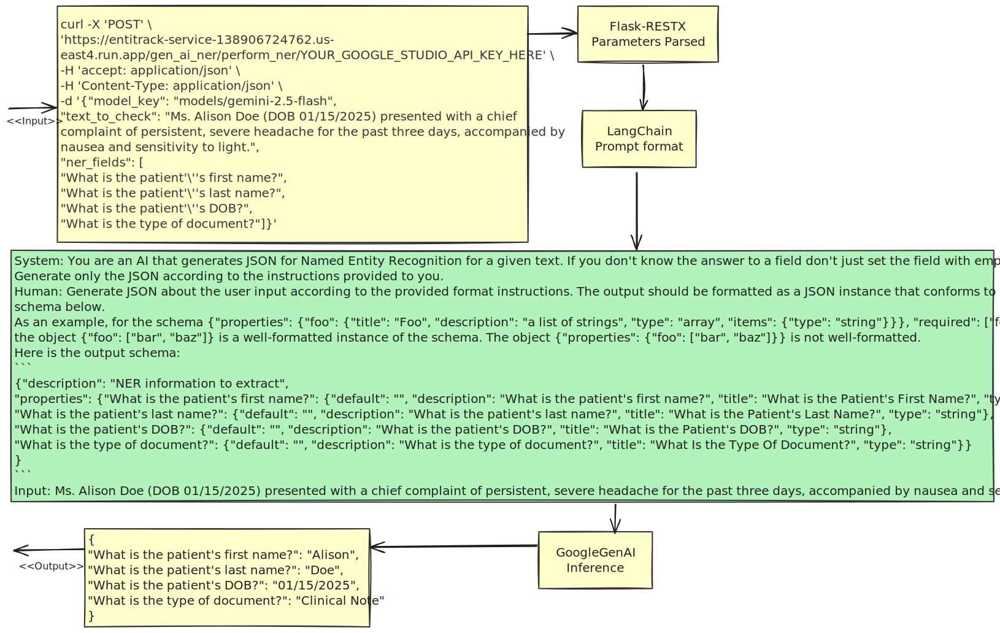
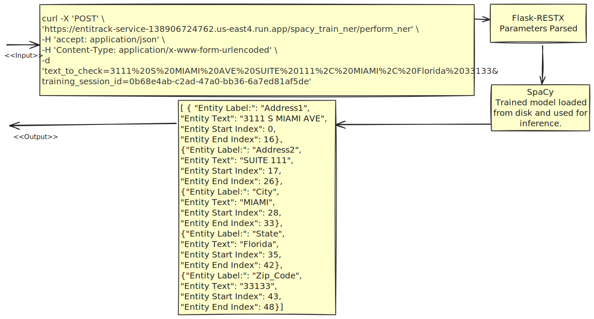
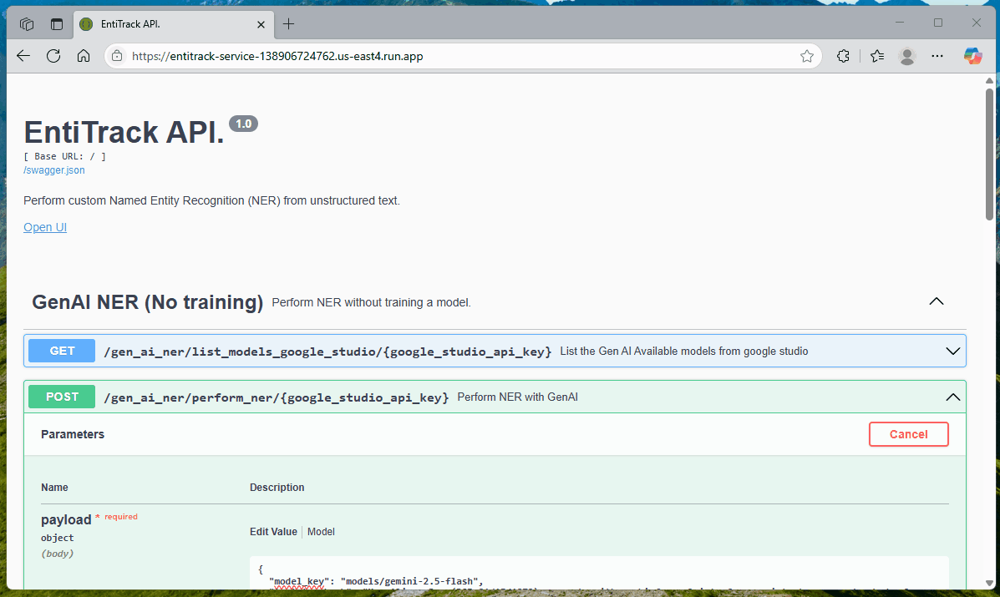
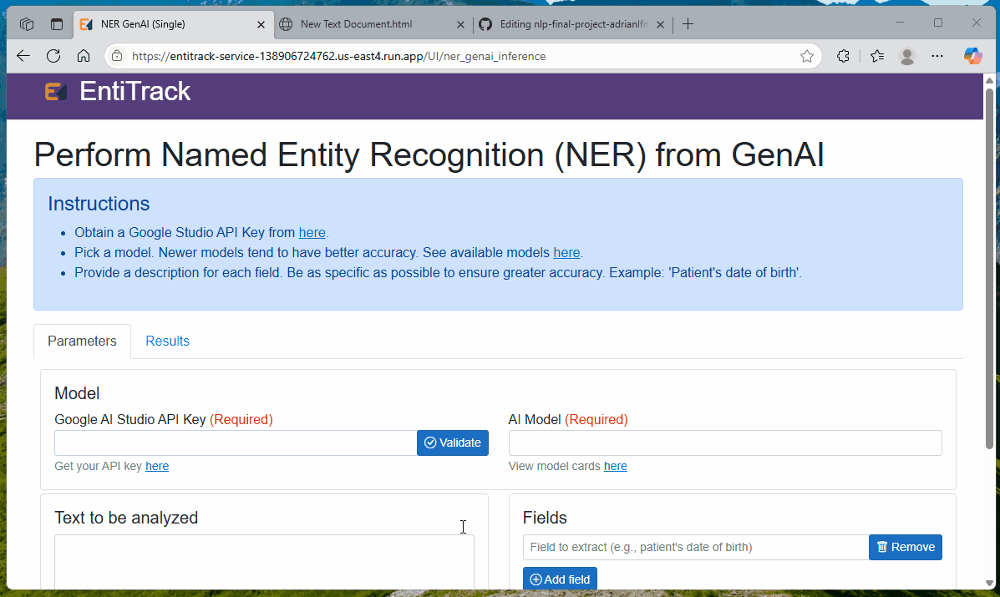
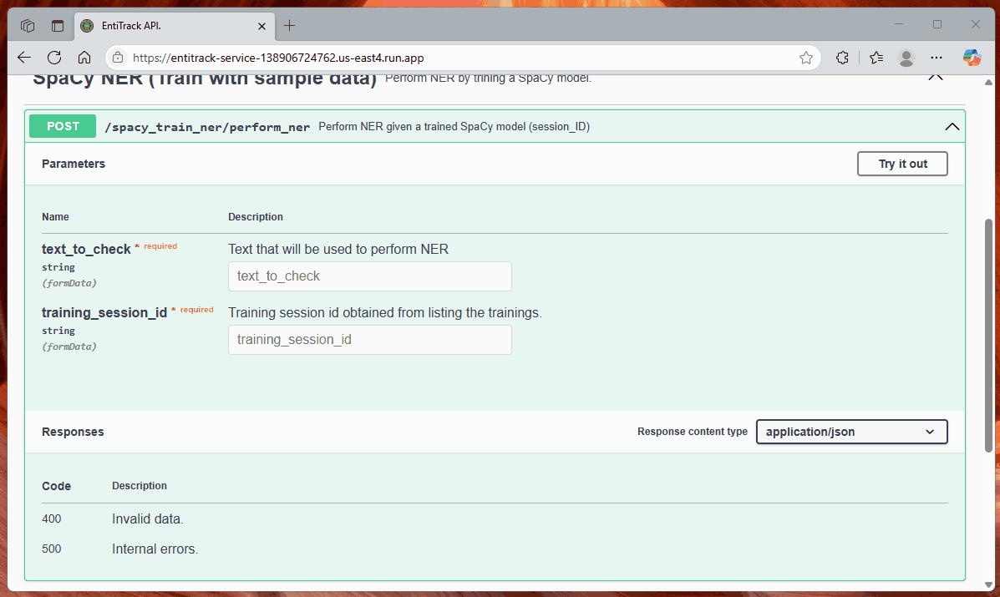

# EntiTrack API and UI  


**EntiTrack** is a powerful, intuitive and customizable toolkit designed for Named Entity Recognition (NER). It supports both developer access via API and user-friendly interaction through a graphical UI.

### Author: Adrian Alfonso [](https://www.linkedin.com/in/alfonsoadrian/)

## 🧩 Problem Statement

Organizations face growing challenges in extracting structured, meaningful data from unstructured sources such as text, images, and PDFs. EntiTrack addresses this need by enabling both developers and end users to perform customizable Named Entity Recognition (NER), streamlining the conversion of unstructured inputs into structured formats while abstracting away technical complexities.

## 📌 Stakeholder Map

| Stakeholder                  | Role/Interest                                   | Needs/Goals | Concerns |
|-----------------------------|--------------------------------------------------|-----------|----------|
| Project Owner (Adrian Alfonso)      | Project developer and end user of EntiTrack.             |  He needs to parse unstructured documents.   | He doesn't want to be constantly coding to structure the unstructured data.    |
| Company owner at company XYZ | Oversees incoming clients to the company XYZ.        | He/She needs to add new customers to the company XYZ but all the incoming customers are bringing unstructured documents that need to be imported to the existing product in a structured manner.      | He/She doesn’t want to lose clients due to IT’s inability to structure unstructured data. Additionally, time is of the essence when acquiring a new customer, and a tool like this will accelerate the import process.   |
| IT director at company XYZ | Responsible for approving the adoption of EntiTrack as the primary tool for transforming unstructured data into structured formats.        | He/She needs a find a tool that gathers structured data from text.     | Needs to make a decision on which tool or implementation to use for performing Named Entity Recognition (NER).   |
| Developer at company XYZ developing product ABC.               | Responsible for ABC product development and implementation.      | He/She needs an API to extract structured information from unstructured sources. The API will be integrated into the product ABC.    |  He/She doesn't want to be constantly coding to structure the unstructured data.|
| Data Analysts At company XYZ.              | Imports data coming from new clients into the database of product ABC.            | He/She needs a tool that gathers structured data from text.    | He/She doesn't want to be constantly coding to structure the unstructured data.      |
| General User | General users interested in performing NER  | Individuals who need to perform NER for certain texts without  dealing with its technical complexities | He/She may not know how to code. | 


## 🎯 SMART Business Goals

1. **Specific**  
   Develop a web service and user-friendly UI that accepts unstructured text and extracts structured information on demand (e.g., Patient Name, DOB, Address, etc.).

2. **Measurable**  
   Achieve at least **95% accuracy** on entity extraction tasks for unstructured documents.

3. **Achievable**  
   Build and compare two extraction engines and UI within 6 weeks:  
   - Option A: A Generative AI model (e.g., via Gemini )  
   - Option B: A traditional NLP model (e.g., SpaCy)
     
4. **Relevant**  
   Directly addresses the need at company XYZ to process unstructured client documents and convert them into structured data for seamless onboarding.

5. **Time-bound**  
   Deliver a fully functional REST API endpoints and a basic frontend—for both extraction modes by **July 16 2025**

## 🧰 Development Tools & Frameworks

### Backend (API & NLP Engine)
- **Flask** – Core web server for handling HTTP requests.
- **Flask-RESTx** – RESTful API framework built on top of Flask with Swagger documentation support.
- **SpaCy** – Used for training and serving custom NLP NER models.
- **LangChain** – Used for formatting prompts and parsing responses when interacting with GenAI components.
- **Google GenAI (via Google AI Studio)** – Performs generative NLP tasks such as dynamic entity extraction and categorization.

### Frontend
- **Blazor** – C#-based web UI framework used to build a responsive front-end that communicates with the backend API.

### Development Environment
- **Visual Studio Code** – Primary IDE for coding, debugging, and extension support.
- **Bash Shell** – Used to install python dependencies and launch API project.
- **Powershell** – Used to compile and publish the Blazor UI project.
- **Google Cloud Run** – Cloud platform used for hosting and deployment of the final web app.

## 🧱Architecture diagram


## 🔀NER Gen AI dataflow with sample prompt


## 🔀NER Trained model dataflow



## 📁 Project folder structure and most relevant files.

```text
├── 📁EntiTrack/                           Root folder for EntiTrack
    ├── 📁EntiTrack_API/                   Folder containing the API project (Python with Flask and Flask-RESTX).
    ├── ├── 📄requirements.txt             File with the listing of dependencies for this project.
    ├── ├── 📄refreshdependencies.sh       Bash script to refresh dependencies from the requirements.txt
    ├── ├── 📄main.py                      Initialization file for this flask rest API project.
    ├── ├── 📁config/                      Folder containing the config files for SpaCy NER training pipeline. 
    ├── ├── 📁apis/                        Folder containing the different namespaces and application logic for the Api.
    ├── ├── ├──📄ns_genai.py               File for handling all the genai related logic and API details (uses google's genai).
    ├── ├── ├──📄ns_train.py               File for handling all the trained related logic and API details (uses SpaCy).
    ├── 📁EntiTrack_UI/                    Folder containing the UI client project that consumes the API (Blazor WebAssembly).
    ├── 📄scr_API_refresh_dependencies.sh  Bash script to install the API required packages.
    ├── 📄scr_API_start.sh                 Bash script to start the API.
    ├── 📄scr_UI_publish.ps1               PowerShell script to compile and publish the UI as static site inside the API project on the UI folder.
    ├── 📄scr_UI_start.ps1                 PowerShell script to start the UI as an independent app.
    ├── 📄scr_publish_start.sh             Bash that publish the UI app and packages the UI inside of the UI path. It also starts the full website.
    ├── 📁docs/                            Folder containing documents related to this product.
    └── 📁sample_data/                     Folder containing sample datasets and corpus of text.
```


## 🚀Running the Project in Development

To get the project running in your development environment, follow these steps:

### API Prerequisites

* Install [Python](https://www.python.org/downloads/)
* Install project dependencies: 
```bash
.\scr_API_refresh_dependencies.sh
```
### UI Prerequisites

* Install [.NET SDK](https://dotnet.microsoft.com/en-us/download/dotnet/9.0)

### Start the API and the UI

Navigate to the repository's root folder in your Bash shell and execute the following command:
```bash
.\scr_publish_start.sh
```


### Using Docker (Optional)
You can run the project with a local Docker installation:

1. Run the command for publishing the UI first:
```bash
.\scr_UI_publish.ps1
```

2. On the command line build your Docker Image:
```bash
docker build -t entitrack . 
```

3. Run your Docker Image:
```bash
docker run -p 8080:8080 entitrack
```

4. Open the browser on http://127.0.0.1/ OR http://127.0.0.1/UI/


## 📦Deploying this project in production with google cloud and a docker file.

1. Create an account on Google Cloud Run.
2. Install the google CLI.
3. On the google CLI run:
```bash
gcloud init
```
4. Deploy to Google Cloud Run:
```bash
gcloud run deploy --source .
```
## 📷Screenshots

### NER GenAI API 


### NER GenAI UI 


### NER Train(using a trained SpaCy model) API


### NER Train(using a trained SpaCy model) UI


## 🌍App demo links
* <a href="https://entitrack-service-138906724762.us-east4.run.app/" target="_blank" rel="noopener noreferrer">API Link</a>
* <a href="https://entitrack-service-138906724762.us-east4.run.app/UI/" target="_blank" rel="noopener noreferrer">UI Link</a>

